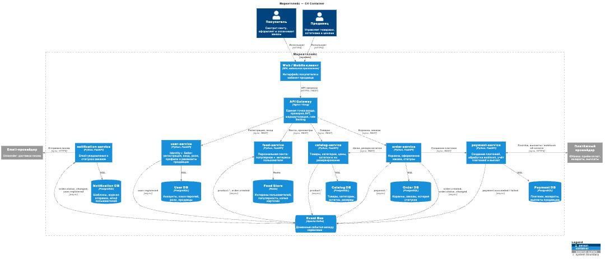

# Архитектура маркетплейса

Домашнее задание №1: архитектурное проектирование маркетплейса (C4 + инициализация сервиса).

Содержание:

- [Архитектура маркетплейса](#архитектура-маркетплейса)
  - [1. Требования](#1-требования)
  - [2. Домены и их ответственность](#2-домены-и-их-ответственность)
  - [3. Варианты декомпозиции](#3-варианты-декомпозиции)
    - [Вариант A. Модульный монолит](#вариант-a-модульный-монолит)
    - [Вариант B. Мелкие микросервисы (сервис на каждый поддомен)](#вариант-b-мелкие-микросервисы-сервис-на-каждый-поддомен)
    - [Вариант C. Прагматичные микросервисы (6 сервисов)](#вариант-c-прагматичные-микросервисы-6-сервисов)
    - [Сравнение](#сравнение)
  - [4. Финальный выбор и обоснование](#4-финальный-выбор-и-обоснование)
  - [5. Распределение доменов по сервисам](#5-распределение-доменов-по-сервисам)
  - [6. Владение данными](#6-владение-данными)
  - [7. Взаимодействие сервисов](#7-взаимодействие-сервисов)
    - [Синхронное (REST)](#синхронное-rest)
    - [Асинхронное (события через Kafka)](#асинхронное-события-через-kafka)
    - [Сценарий: оформление и оплата заказа](#сценарий-оформление-и-оплата-заказа)
  - [8. C4 Container диаграмма](#8-c4-container-диаграмма)
  - [9. Запуск сервиса](#9-запуск-сервиса)
    - [Требования](#требования)
    - [Запуск](#запуск)
    - [Проверка](#проверка)
    - [Остановка](#остановка)
    - [Запуск без Docker (для разработки)](#запуск-без-docker-для-разработки)
  - [10. Структура репозитория](#10-структура-репозитория)

---

## 1. Требования

**Функциональные (из кейса):** персонализированная лента товаров, управление каталогом продавцами, управление пользователями (покупатели и продавцы), оформление заказов, расчёт и учёт платежей, уведомления о статусах заказов.

**Нефункциональные — приоритеты, от которых я отталкивался:**

| Свойство                                 | Где важно                                                                       | Что из этого следует                                                     |
| ---------------------------------------- | ------------------------------------------------------------------------------- | ------------------------------------------------------------------------ |
| Доступность и масштабируемость на чтение | Лента и каталог — основной трафик, читают на порядки чаще, чем оформляют заказы | Эти части масштабируются отдельно от заказов и платежей                  |
| Согласованность                          | Платежи и остатки: нельзя списать деньги дважды или продать больше, чем есть    | Резерв остатка — синхронно; платежи — идемпотентно, с отдельным учётом   |
| Безопасность данных                      | Платёжные данные, реквизиты продавцов, пароли                                   | Платёжный учёт изолирован; карты не храним — работаем через провайдера   |
| Темп изменений                           | Логика ленты будет часто меняться (эксперименты), платёжная — редко             | Ленту и платежи не держим в одной границе                                |
| Слабая временная связанность             | Уведомления, обновление ленты                                                   | Асинхронно через события: падение получателя не ломает оформление заказа |

**Принятые продуктовые допущения:**

- Персонализация — на правилах: «популярное» + товары из категорий, которые пользователь смотрел или покупал. ML на этом этапе не нужен, но выделенный feed-service позволит добавить его позже, не трогая остальные сервисы.
- Деньги принимает внешний платёжный провайдер (ЮKassa). Мы не обрабатываем данные карт и не попадаем под PCI DSS, а у себя ведём учёт: платежи, возвраты, выплаты продавцам.
- Уведомления — только email (через внешний провайдер).
- Остатки товаров ведёт продавец вместе с карточкой товара, один склад на продавца.

---

## 2. Домены и их ответственность

Домены выделены по бизнес-возможностям из кейса (подход DDD: проектируем вокруг предметной области, а не таблиц).

| Домен             | Зона ответственности                                                                             | Ключевые термины                  |
| ----------------- | ------------------------------------------------------------------------------------------------ | --------------------------------- |
| **Identity**      | Регистрация, аутентификация, роли (покупатель / продавец), выдача JWT                            | аккаунт, роль, токен              |
| **Seller**        | Профиль продавца, юрлицо, верификация, реквизиты для выплат                                      | продавец, ИНН, верификация        |
| **Catalog**       | Карточки товаров, категории, цены, остатки, резервирование остатков                              | товар, категория, остаток, резерв |
| **Feed**          | Формирование персональной ленты по интересам пользователя и популярности                         | лента, интерес, популярность      |
| **Ordering**      | Корзина, оформление заказа, жизненный цикл и статусы заказа                                      | корзина, заказ, статус            |
| **Payments**      | Создание платежа у провайдера, обработка результата, учёт платежей, возвратов и выплат продавцам | платёж, возврат, выплата          |
| **Notifications** | Отправка email о смене статуса заказа, шаблоны, журнал отправок                                  | уведомление, шаблон               |

«Управление пользователями» я разделил на два домена. У Identity и Seller разные данные (логины и хэши паролей vs ИНН и банковские реквизиты) и разные причины изменений: вход в систему происходит постоянно, а реквизиты меняются редко и требуют проверки.

---

## 3. Варианты декомпозиции

Рассмотрел три существенно разных варианта.

### Вариант A. Модульный монолит

Одно приложение, внутри — модули по доменам из раздела 2. Одна БД PostgreSQL, у каждого модуля своя схема; модули общаются через внутренние интерфейсы, а не через чужие таблицы. Развёртывается целиком.

**Плюсы:**

- Вызовы внутри процесса: быстро, без сетевых отказов, таймаутов и повторов.
- Оформление заказа (резерв остатка + создание заказа + платёж) — одна ACID-транзакция в одной БД.
- Один артефакт: проще CI/CD, тестирование, логи и отладка.
- Дешевле инфраструктура: не нужны брокер, gateway, шесть баз.
- Чёткие границы модулей оставляют путь к выделению сервисов позже.

**Минусы:**

- Масштабируется только целиком: чтобы выдержать трафик ленты и каталога, приходится масштабировать и заказы с платежами.
- Любое изменение (например, частый эксперимент с лентой) — релиз всего приложения, включая платёжную часть.
- Ошибка или утечка памяти в одном модуле роняет весь маркетплейс, в том числе приём заказов.
- Платёжные данные лежат в той же БД и процессе, что и остальное, — сложнее разграничить доступ и аудит.
- Границы модулей держатся на дисциплине: без контроля модули начинают ходить в чужие схемы.

### Вариант B. Мелкие микросервисы (сервис на каждый поддомен)

~10 сервисов: identity, seller, catalog, inventory, cart, order, payment, payout, feed, notification. У каждого своя БД.

**Плюсы:**

- Максимальная независимость развёртывания и масштабирования каждого поддомена.
- Маленькие кодовые базы, которые легко передать отдельным командам.
- Отказ одного сервиса затрагивает минимальную часть функциональности.

**Минусы:**

- Высокий coupling между тесно связанными частями. Корзина и заказ — по сути одна модель на разных стадиях (как посты и черновики в примере с лекции); catalog и inventory, payment и payout тоже меняются вместе. Изменение одного бизнес-правила затрагивает 2–3 сервиса.
- Риск распределённого монолита: сервисы формально раздельные, но релизятся совместно.
- Оформление заказа превращается в длинную цепочку синхронных вызовов (cart → order → inventory → catalog → payment): суммарная задержка и вероятность отказа растут.
- Больше распределённых транзакций и саг, больше контрактов между сервисами.
- Высокая инфраструктурная стоимость (10 сервисов + 10 БД) при отсутствии десяти команд.

### Вариант C. Прагматичные микросервисы (6 сервисов)

Сервисы по крупным бизнес-возможностям: **user** (Identity + Seller), **catalog** (вместе с остатками), **feed**, **order** (вместе с корзиной), **payment**, **notification**. Database per service, синхронный REST там, где нужен немедленный ответ, и события через Kafka там, где допустима eventual consistency.

**Плюсы:**

- Разделение проведено только там, где есть конкретная причина: разная нагрузка (feed, catalog), чувствительные данные (payment), разный темп изменений (feed vs payment), асинхронная природа (notification).
- Тесно связанные части (корзина + заказ, товар + остаток, аккаунт + продавец) остаются внутри одного сервиса — высокая cohesion, изменения бизнес-правил локальны.
- Лента и каталог масштабируются отдельно от заказов и платежей.
- Падение notification или feed не мешает оформлять и оплачивать заказы.
- Платёжный учёт изолирован: отдельная БД, отдельные права доступа и аудит.

**Минусы:**

- Цена распределённости: сетевые отказы, таймауты, нужна идемпотентность (особенно у платежей и резерва).
- Нет одной ACID-транзакции на оформление заказа — нужна сага с компенсациями (отмена резерва при неуспешной оплате).
- Eventual consistency: лента и уведомления отстают от реальных данных на секунды.
- Нужна инфраструктура: Kafka, API Gateway, 6 БД, централизованные логи и трассировка (correlation id).
- user-service объединяет два домена — если работа с продавцами сильно разрастётся, его придётся делить.

### Сравнение

| Критерий                          | A. Модульный монолит | B. Мелкие микросервисы          | C. 6 сервисов    |
| --------------------------------- | -------------------- | ------------------------------- | ---------------- |
| Независимый релиз                 | нет                  | да, но на деле часто совместный | да               |
| Раздельное масштабирование чтения | нет                  | да                              | да               |
| Согласованность заказа            | ACID                 | саги на много шагов             | сага на 2–3 шага |
| Изоляция платёжных данных         | слабая               | сильная                         | сильная          |
| Coupling между частями            | внутри процесса      | высокий                         | низкий           |
| Инфраструктурная стоимость        | низкая               | высокая                         | средняя          |
| Сложность эксплуатации            | низкая               | высокая                         | средняя          |

---

## 4. Финальный выбор и обоснование

**Выбран вариант C — 6 сервисов.**

Почему не A (монолит). На лекции мы разбирали, что микросервисы оправданы, только если независимое развитие окупает их цену. Здесь есть конкретные ограничения, которые монолит закрывает плохо:

1. **Профиль нагрузки.** Лента и каталог получают основной трафик, а заказы и платежи — малую его долю. В монолите пришлось бы масштабировать всё вместе.
2. **Темп изменений (волатильность).** Персонализация ленты — область постоянных экспериментов. В монолите каждый такой эксперимент — релиз, рядом с которым лежит платёжный код.
3. **Чувствительные данные.** Платежи и реквизиты требуют отдельного контроля доступа и аудита — это прямой аргумент за отдельную границу.
4. **Изоляция отказов.** Уведомления зависят от внешнего email-провайдера, а оформление заказа от этого зависеть не должно.

Почему не B. Дробление тесно связанных частей (корзина/заказ, товар/остаток, платёж/выплата) даёт высокий coupling и превращает систему в распределённый монолит: те же совместные релизы, но с сетью и распределёнными транзакциями. Для учебного проекта и небольшой команды это чистая стоимость без выгоды.

Вариант C — середина: сервисов ровно столько, сколько есть реальных причин для разделения, а внутри каждого сохраняется высокая cohesion. Если какая-то часть вырастет (например, работа с продавцами), её можно выделить позже.

---

## 5. Распределение доменов по сервисам

| Сервис                   | Домены                                | Почему так                                                                                                                                                                                                                                                 |
| ------------------------ | ------------------------------------- | ---------------------------------------------------------------------------------------------------------------------------------------------------------------------------------------------------------------------------------------------------------- |
| **user-service**         | Identity, Seller                      | Оба домена про участников платформы, оба слабо нагружены и редко меняются. Продавец всегда привязан к аккаунту, а проверку роли «продавец» удобно делать там же, где выдаются токены. Отдельный seller-service сейчас добавил бы сетевой вызов без выгоды. |
| **catalog-service**      | Catalog (включая остатки)             | Товар и его остаток меняются вместе (продавец редактирует их в одной карточке), а резерв должен быть атомарным с проверкой остатка — это одна транзакция в одной БД. Высокая нагрузка на чтение — масштабируется отдельно.                                 |
| **feed-service**         | Feed                                  | Самая волатильная часть (эксперименты с алгоритмом), свой профиль нагрузки и своё хранилище (Redis). Работает на событиях, поэтому почти не зависит от остальных.                                                                                          |
| **order-service**        | Ordering (корзина + заказы)           | Корзина — это заказ до оформления: одна модель, одни правила. Разделение дало бы высокий coupling. Оркестрирует сагу оформления заказа.                                                                                                                    |
| **payment-service**      | Payments (платежи, возвраты, выплаты) | Чувствительные финансовые данные, требования к аудиту и идемпотентности, интеграция с провайдером. Выплаты продавцам — часть того же денежного учёта.                                                                                                      |
| **notification-service** | Notifications                         | Асинхронный по природе, зависит от внешнего провайдера. Его отказ не должен влиять на заказы — поэтому слушает события, а не вызывается синхронно.                                                                                                         |

Отдельно — **API Gateway**: инфраструктурный компонент без бизнес-логики. Единая точка входа для клиентов, проверка JWT (по публичному ключу user-service), маршрутизация, rate limiting.

---

## 6. Владение данными

Принцип: **database per service**. Сервис — единственный, кто читает и пишет свою БД; остальные получают данные только через его API или события. Общих баз нет.

| Сервис               | Владеет данными                                                                    | Отвечает за                                              | Хранилище  |
| -------------------- | ---------------------------------------------------------------------------------- | -------------------------------------------------------- | ---------- |
| user-service         | аккаунты, хэши паролей, роли, профили продавцов, юрлица, реквизиты                 | аутентификацию, выдачу JWT, верификацию продавцов        | PostgreSQL |
| catalog-service      | товары, категории, цены, остатки, резервы                                          | корректность каталога, недопущение продажи сверх остатка | PostgreSQL |
| feed-service         | интересы пользователей, счётчики популярности, копия карточек товаров (read-model) | сборку персональной ленты                                | Redis      |
| order-service        | корзины, заказы, позиции заказов (с ценой на момент покупки), история статусов     | жизненный цикл заказа, сагу оформления                   | PostgreSQL |
| payment-service      | платежи, возвраты, выплаты продавцам, ключи идемпотентности                        | денежный учёт, сверку с провайдером                      | PostgreSQL |
| notification-service | шаблоны писем, журнал отправок, копия email пользователей                          | доставку уведомлений                                     | PostgreSQL |

Как сервисы обходятся без чужих баз:

- **feed-service** хранит у себя копию нужных полей товара (название, категория, цена), обновляя её по событиям `product.created / product.updated`. Лента отдаётся без синхронных походов в catalog.
- **notification-service** хранит email пользователя, полученный из события `user.registered`. Письмо уходит, даже если user-service недоступен.
- **order-service** фиксирует цену в позиции заказа на момент оформления — дальнейшее изменение цены в каталоге не меняет уже созданный заказ.

Копии данных — осознанный компромисс: они могут отставать на секунды (eventual consistency), зато сервисы не связаны синхронными вызовами.

---

## 7. Взаимодействие сервисов

### Синхронное (REST)

Используется там, где вызывающему нужен ответ прямо сейчас.

| Кто → кому                     | Зачем                                     | Почему синхронно                                             |
| ------------------------------ | ----------------------------------------- | ------------------------------------------------------------ |
| Клиент → API Gateway → сервисы | все пользовательские запросы              | пользователь ждёт ответ                                      |
| order → catalog                | проверить цену и зарезервировать остаток  | нельзя подтвердить заказ, не зная, есть ли товар             |
| order → payment                | создать платёж, получить ссылку на оплату | ссылку нужно сразу отдать покупателю                         |
| payment → провайдер            | создать платёж, выплаты продавцам         | API провайдера                                               |
| провайдер → payment            | webhook о результате оплаты               | так работает провайдер; обработка идемпотентна по id платежа |
| notification → email-провайдер | отправка письма                           | API провайдера                                               |

Цепочка синхронных вызовов при оформлении заказа ограничена двумя шагами (order → catalog, order → payment), чтобы не накапливать задержку и вероятность отказа.

### Асинхронное (события через Kafka)

Используется там, где допустима задержка и важна слабая связанность.

| Событие                               | Публикует | Слушают      | Что происходит                                              |
| ------------------------------------- | --------- | ------------ | ----------------------------------------------------------- |
| `user.registered`                     | user      | notification | сохраняет email пользователя                                |
| `product.created`, `product.updated`  | catalog   | feed         | обновляет копию карточки товара                             |
| `order.created`                       | order     | feed         | учитывает интерес пользователя к категориям                 |
| `order.status_changed`                | order     | notification | отправляет email о новом статусе                            |
| `payment.succeeded`, `payment.failed` | payment   | order        | меняет статус заказа: оплачен / отменён (с отменой резерва) |

Почему Kafka, а не RabbitMQ: одно и то же событие читают несколько независимых потребителей (например, события заказа — и feed, и notification), а лог событий можно перечитать — например, чтобы пересобрать ленту после изменения алгоритма.

Просмотры товаров клиент отправляет напрямую в feed-service (через gateway, без ожидания результата). Так catalog не берёт на себя ответственность за аналитику.

### Сценарий: оформление и оплата заказа

1. Покупатель оформляет корзину → gateway → **order-service** создаёт заказ в статусе `created`.
2. order → **catalog** (sync): резерв остатков по позициям. Нет остатка — заказ отклоняется сразу.
3. order → **payment** (sync): создаётся платёж у провайдера, покупатель получает ссылку на оплату. Заказ — `awaiting_payment`.
4. Покупатель платит, провайдер шлёт webhook в **payment-service**; тот записывает результат и публикует `payment.succeeded` или `payment.failed`.
5. **order-service** получает событие: `paid` — или `cancelled` с компенсацией (отменой резерва в catalog). Публикует `order.status_changed`.
6. **notification-service** получает событие и отправляет email.

Шаги 2–5 — сага с компенсацией вместо одной транзакции. Для надёжности: ключи идемпотентности при резерве и создании платежа (повтор запроса не создаёт дубль), а события публикуются через transactional outbox, чтобы изменение в БД и событие не расходились.

---

## 8. C4 Container диаграмма

Исходник: [`docs/c4-container.puml`](docs/c4-container.puml) (C4-PlantUML).



На диаграмме: пользователи (покупатель, продавец), внешние системы (платёжный и email-провайдеры), контейнеры маркетплейса — клиент, API Gateway, 6 сервисов, у каждого своя БД, и шина событий Kafka. На связях подписан способ взаимодействия (sync / async) и протокол.

---

## 9. Запуск сервиса

В Docker поднят **catalog-service** (Python 3.12, FastAPI) вместе со своей БД PostgreSQL — иллюстрация принципа «сервис + собственная база». Бизнес-логики нет.

Эндпоинты:

| Метод | Путь            | Ответ                                                        |
| ----- | --------------- | ------------------------------------------------------------ |
| GET   | `/health`       | `200 OK` — сервис запущен (liveness)                         |
| GET   | `/health/ready` | `200 OK`, если есть соединение с БД, иначе `503` (readiness) |

### Требования

- Docker и Docker Compose (Docker Desktop)

### Запуск

```bash
git clone <url-репозитория>
cd marketplace-architecture
docker compose up --build
```

### Проверка

```bash
curl -i http://localhost:8000/health
# HTTP/1.1 200 OK
# {"status":"ok","service":"catalog-service"}

curl -i http://localhost:8000/health/ready
# HTTP/1.1 200 OK
# {"status":"ok","service":"catalog-service","db":"up"}
```

Также доступна автодокументация FastAPI: http://localhost:8000/docs

### Остановка

```bash
docker compose down        # остановить
docker compose down -v     # остановить и удалить данные БД
```

### Запуск без Docker (для разработки)

```bash
cd catalog-service
python -m venv .venv && source .venv/bin/activate
pip install -r requirements.txt
uvicorn app.main:app --reload
```

`/health` будет отвечать 200 OK; `/health/ready` вернёт 503, пока не запущен PostgreSQL.

---

## 10. Структура репозитория

```
.
├── README.md                 # архитектура и решения
├── docker-compose.yml        # catalog-service + его PostgreSQL
├── docs/
│   ├── c4-container.puml     # исходник C4 Container диаграммы
│   └── c4-container.png      # отрисованная диаграмма
└── catalog-service/
    ├── Dockerfile
    ├── requirements.txt
    └── app/
        └── main.py           # FastAPI: /health, /health/ready
```
